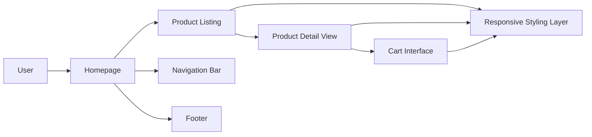

<div align="center">

# 🛒 E-Commerce Website

### A responsive front-end shopping website built with HTML, CSS, and JavaScript for a clean, modern, and interactive online store experience.


<br/>


</div>

---

## 🧾 Overview

**E-Commerce Website** is a responsive front-end project created to simulate a basic online shopping platform with a polished user interface and structured product presentation. It focuses on **layout design**, **responsive styling**, and **interactive UI behavior** using only core web technologies.

The project demonstrates how a clean front-end can create a user-friendly shopping experience without requiring backend integration. It is ideal for practicing product display design, page structuring, and JavaScript-based interface interactions.

---

## 🎯 Purpose

This project was built to strengthen front-end development fundamentals, especially in the context of **real-world web UI design**. It focuses on:

- responsive page layouts,
- product listing design,
- product detail presentation,
- reusable navigation and footer sections,
- and interactive shopping interface elements.

It serves as a strong foundation for learners building toward full-stack e-commerce platforms.

---

## ✨ Features

- 🏠 Responsive homepage layout
- 📦 Structured product listing section
- 🔎 Product detail view
- 🧭 Navigation bar and footer
- 🛒 Add to cart interface (UI level)
- 🎨 Clean and modern design
- 📱 Mobile-friendly structure
- ⚡ Lightweight front-end implementation

---

## 🛠 Tech Stack

| Layer | Technology |
|------|------------|
| **Frontend** | HTML, CSS, JavaScript |
| **Design** | Responsive layout, reusable UI sections |
| **Version Control** | Git, GitHub |
| **Editor / Workflow** | VS Code, browser preview |

<div align="center">


</div>

---

## 🏗️ Frontend Architecture



---

## 📌 Core Pages and UI Sections

| Section | Description |
|--------|-------------|
| **Homepage** | Main landing page with responsive structure and product visibility. |
| **Products Page** | Displays items in an organized grid or listing format. |
| **Product Detail View** | Shows selected product information in a focused layout. |
| **Cart Interface** | Basic add-to-cart UI interaction for shopping flow simulation. |
| **Navigation & Footer** | Provides structure, branding, and page navigation. |

---

## 📂 Project Structure

```bash
E-Commerce-Website/
│
├── index.html
├── products.html
├── style.css
├── script.js
└── assets/
```

---

## ⚙️ How to Run

### 1. Clone the repository

```bash
git clone https://github.com/your-username/your-repo-name.git
```

### 2. Open the project folder

```bash
cd your-repo-name
```

### 3. Run the website

Open `index.html` directly in your browser.

You can also use VS Code Live Server for a smoother local preview.

---

## 💡 What This Project Demonstrates

This project helps practice and demonstrate:

- semantic HTML page structuring,
- CSS-based responsive layouts,
- front-end component organization,
- JavaScript-powered interaction,
- e-commerce UI design patterns,
- and beginner-to-intermediate web development skills.

It is useful as both a **learning project** and a **portfolio-ready front-end showcase**.

---

## 🖥 User Experience Highlights

- Simple and clean shopping interface
- Easy product browsing flow
- Responsive behavior across devices
- Product-focused layout design
- UI-level cart interaction for a realistic storefront feel

---

## 🚀 Future Improvements

- Backend integration using Node.js, PHP, or Django
- Database connectivity for products and cart data
- Payment gateway integration
- User authentication system
- Admin dashboard for product management
- Full cart and checkout functionality
- Search and filter system
- Wishlist and order tracking features

---

## 🤝 Contributing

Contributions are welcome.

1. Fork the repository
2. Create a feature branch
3. Improve the UI or functionality
4. Commit your changes
5. Open a pull request

```bash
git checkout -b feature/improve-product-ui
git commit -m "Enhance responsive product card design"
git push origin feature/improve-product-ui
```

---

## 👨‍💻 Author

Developed as a **front-end web development practice project** to improve skills in responsive design, page structuring, and interactive e-commerce UI creation.

<div align="center">

### Design the storefront. Shape the shopping experience.

</div>
